# نمودار توالی عملیات «تصمیم‌یار جامع محله»

> نمای کامل تعاملات زمان‌بندی‌شده میان کاربر، موتورهای تحلیل و تشخیص، ۹ منبع داده برخط، حافظه زنده و چرخه یادگیری — متناظر با ۶ گام موشن‌گرافیک `tasminyar-motion-graphic.html`.
> برای مشاهده: فایل را در VS Code (افزونه Markdown Preview Mermaid)، Obsidian یا mermaid.live باز کنید.

```mermaid
sequenceDiagram
    autonumber
    actor U as مدیر محله (کاربر)
    participant UI as رابط کاربری تحلیلی
    participant OR as ارکستراتور اجرا<br/>Run Orchestrator
    participant GEO as سرویس ژئوکد و AOI
    participant MEM as حافظه زنده<br/>Living Memory
    participant CON as لایه اتصال منابع<br/>Evidence Connectors
    participant SRC as ۹ منبع داده برخط<br/>OSM · Healthsites · Open-Meteo ·<br/>WorldBank · STAC/COG · WHO · UNESCO · شبکه معابر
    participant CAC as کش شواهد<br/>با اعتبار زمانی
    participant AGG as موتور تجمیع و اثرانگشت
    participant ENG as موتور تحلیل پنج‌مرحله‌ای
    participant DIA as موتور تشخیص CAUEO
    participant REC as موتور رتبه‌بندی مداخله‌ها
    participant RPT as تولیدکننده کارت تصمیم و خروجی‌ها
    participant AUD as لایه ممیزی و استنادپذیری
    participant MON as زیرسیستم پایش پیامد
    participant PEER as سرویس مقایسه همتایان

    rect rgb(14, 22, 38)
    note over U,GEO: فاز ۱ · شناسایی محله و قفل پنجره تحلیل
    U->>UI: ورود نام محله: «باغ فیض، تهران»
    UI->>UI: اعتبارسنجی و نرمال‌سازی متن فارسی
    UI->>GEO: درخواست ژئوکد + مرز اداری محله
    GEO->>SRC: پرس‌وجوی ژئوکد (Nominatim/OSM)
    alt محله به‌صورت یکتا یافت شد
        SRC-->>GEO: مختصات 35.7219N · 51.4047E + مرز پلیگونی
    else ابهام در نام (چند کاندید)
        SRC-->>GEO: فهرست کاندیدها
        GEO-->>UI: نمایش گزینه‌های مرتب
        UI->>U: درخواست انتخاب دقیق
        U->>UI: انتخاب کاندید صحیح
        UI->>GEO: ژئوکد مجدد
    else عدم یافت
        SRC-->>GEO: نتیجه تهی
        GEO-->>UI: خطای قابل‌اقدام
        UI->>U: پیشنهاد ترسیم دستی محدوده روی نقشه
        U->>GEO: ترسیم دستی AOI
    end
    GEO->>GEO: ساخت پنجره تحلیل AOI + قفل مکانی + هش محدوده
    GEO->>MEM: جست‌وجوی سوابق قبلی همین AOI
    MEM-->>GEO: سابقه قبلی / نبود سابقه
    GEO-->>UI: محله قفل شد (کادر گوشه‌دار AOI + پین)
    end

    rect rgb(10, 26, 34)
    note over U,AUD: فاز ۲ · تعریف سناریوی تصمیم و مانیفست اجرا
    U->>UI: انتخاب خط پایه + گروه هدف (سالمندان، کودکان، ...)
    U->>UI: تعیین افق تصمیم (فوری / ۶ ماهه / چندساله)
    UI->>OR: ارسال مشخصات سناریو
    OR->>MEM: واکشی نسخه قواعد و وزن‌های جاری
    MEM-->>OR: Ruleset v2.4 + ماتریس وزن‌ها
    OR->>OR: ساخت RunManifest<br/>(شناسه اجرا، AOI، سناریو، نسخه قواعد، مهر زمان)
    OR->>AUD: ثبت شروع اجرا با امضای زمانی
    AUD-->>OR: تأیید ثبت
    OR-->>UI: نمایش لاگ اجرا با مهر T+
    end
```

```mermaid
sequenceDiagram
    autonumber
    actor U as مدیر محله (کاربر)
    participant UI as رابط کاربری تحلیلی
    participant OR as ارکستراتور اجرا
    participant CON as لایه اتصال منابع
    participant SRC as ۹ منبع داده برخط
    participant CAC as کش شواهد
    participant AGG as موتور تجمیع و اثرانگشت
    participant ENG as موتور تحلیل پنج‌مرحله‌ای
    participant DIA as موتور تشخیص CAUEO
    participant MEM as حافظه زنده
    participant AUD as لایه ممیزی

    rect rgb(14, 30, 30)
    note over U,AUD: فاز ۳ · گردآوری هم‌زمان شواهد از ۹ منبع برخط
    OR->>CON: فعال‌سازی ۹ کانکتور با RunManifest
    par اتصال موازی به منابع
        CON->>SRC: OSM · امکانات و کاربری‌ها (برخط)
    and
        CON->>SRC: Healthsites · ظرفیت سلامت (برخط)
    and
        CON->>SRC: Open-Meteo · اقلیم جاری + تاریخچه (برخط)
    and
        CON->>SRC: World Bank + WHO GHO + UNESCO UIS (شاخص‌های کلان)
    and
        CON->>SRC: STAC/COG ماهواره‌ای + شبکه معابر
    end
    loop برای هر منبع (با مهلت و تلاش مجدد)
        alt پاسخ موفق در مهلت
            SRC-->>CON: داده خام + متادیتای منبع (زمان، نسخه، پوشش)
            CON->>AGG: ارسال بسته با اثرانگشت «برخط»
        else وقفه یا خطای شبکه
            CON->>CAC: بازیابی آخرین نسخه معتبر منبع
            alt کش تازه است
                CAC-->>CON: داده کش + برچسب «کش» + تاریخ انقضا
                CON->>AGG: ارسال بسته با اثرانگشت «کش»
            else کش منقضی یا ناموجود
                CAC-->>CON: شکاف داده
                CON->>AGG: ثبت خلأ پوشش → کاهش امتیاز اطمینان
            end
        end
    end
    AGG->>AGG: نگاشت به ۴۱۹ شاخص استاندارد + آشکارسازی ناسازگاری بین منابع
    AGG->>AUD: ثبت فهرست اثرانگشت (منبع، زمان، نسخه، تأخیر)
    AGG-->>OR: EvidencePack · ۴۱۹ شاخص + درجه پوشش داده
    OR-->>UI: شمارنده شاخص‌ها ۰→۴۱۹ + نوار پیشرفت
    end

    rect rgb(22, 22, 40)
    note over U,AUD: فاز ۴ · موتور تحلیل پنج‌مرحله‌ای
    OR->>ENG: ارسال EvidencePack + ماتریس وزن‌ها
    ENG->>ENG: مرحله ۱ · نرمال‌سازی ۰..۱۰۰ (جهت‌دهی مثبت/منفی + مهار داده‌های پرت)
    ENG->>ENG: مرحله ۲ · وزن‌دهی ترکیبی (AHP خبره + آنتروپی داده)
    ENG->>ENG: مرحله ۳ · تجمیع سلسله‌مراتبی: شاخص ← زیربعد ← بعد
    ENG->>ENG: مرحله ۴ · استخراج امتیاز ۸ سرمایه H·S·E·P·N·C·G·R
    ENG->>ENG: مرحله ۵ · محاسبه اطمینان (پوشش، تازگی، سازگاری منابع)
    alt پوشش داده کمتر از آستانه
        ENG-->>OR: هشدار اطمینان پایین + فهرست شاخص‌های فاقد داده
        OR->>UI: نمایش شفاف‌سازی محدوده اطمینان
    else پوشش کافی
        ENG-->>OR: CapitalProfile · ۸ امتیاز + نوار اطمینان
    end
    note over ENG: خروجی نمونه: انسانی ۶۱ · اجتماعی ۴۴ · اقتصادی ۵۷<br/>کالبدی ۴۹ · طبیعی ۶۶ · فرهنگی ۵۲ · نهادی ۳۸ (بحرانی) · حکمرانی ۵۵
    end

    rect rgb(34, 20, 24)
    note over U,AUD: فاز ۵ · تشخیص: زنجیره ظرفیت تا پیامد
    OR->>DIA: ارسال CapitalProfile + سناریو
    DIA->>DIA: ساخت زنجیره C←A←U←E←O<br/>ظرفیت ۶۲ · دسترسی ۵۴ · استفاده ۴۱ · عدالت ۳۷ · پیامد ۳۰
    DIA->>DIA: محاسبه شکاف‌های مرحله‌ای (−۸ · −۱۳ · −۴ · −۷)
    DIA->>DIA: شناسایی گلوگاه: حلقه دسترسی→استفاده (−۱۳)
    DIA->>ENG: درخواست ماتریس عدالت (۴ گروه × ۴ حوزه)
    ENG-->>DIA: EquityMatrix
    DIA->>DIA: تولید فرضیه‌های علی (همگرا / فرضیه اولیه / آزموده‌شده)
    DIA->>MEM: بازیابی کتابخانه تیپ‌های محله A–E
    MEM-->>DIA: الگوهای تیپ + سوابق مشابه
    DIA->>DIA: تطبیق تیپ → «B · سرمایه محبوس»
    DIA-->>OR: DiagnosisReport (زنجیره، گلوگاه، عدالت، فرضیه‌ها، تیپ)
    end
```

```mermaid
sequenceDiagram
    autonumber
    actor U as مدیر محله (کاربر)
    participant UI as رابط کاربری تحلیلی
    participant OR as ارکستراتور اجرا
    participant DIA as موتور تشخیص CAUEO
    participant ENG as موتور تحلیل
    participant REC as موتور رتبه‌بندی مداخله‌ها
    participant RPT as تولیدکننده کارت تصمیم و خروجی‌ها
    participant MEM as حافظه زنده
    participant AUD as لایه ممیزی
    participant MON as زیرسیستم پایش پیامد
    participant PEER as سرویس مقایسه همتایان
    participant SRC as منابع داده برخط

    rect rgb(16, 32, 40)
    note over U,SRC: فاز ۶ · صدور کارت تصمیم و خروجی‌های همراه
    OR->>REC: ارسال DiagnosisReport
    REC->>REC: فیلتر مداخله‌های مرتبط با تیپ B و گلوگاه دسترسی→استفاده
    REC->>REC: امتیازدهی: اثر × امکان‌پذیری × سرعت اجرا
    note over REC: رتبه‌بندی: ۸۷ ناوبری سالمندان · ۷۲ پویش مشارکت · ۵۸ ناوبری دیجیتال
    REC->>REC: طرح ارزیابی هر مداخله (پنجره ۶ ماهه + ۴ سنجه پیامد)
    REC-->>OR: InterventionSet مرتب‌شده
    OR->>ENG: محاسبه گیج‌های اعتماد (کیفیت Q=۶۲ · پوشش T=۴۱ · تازگی R=۷۴)
    ENG-->>OR: TrustProfile + وضعیت داینامیک (بحرانی ← نیازمند توجه ← پایدار)
    OR->>RPT: تجمیع نهایی کارت تصمیم
    RPT->>RPT: رندر کارت + گذر از چک‌لیست قواعد شفافیت
    RPT-->>UI: کارت تصمیم تعاملی
    UI-->>U: نمایش کارت + توصیه‌های رتبه‌بندی‌شده
    opt درگاه تصمیم انسانی
        U->>UI: تأیید / اصلاح / ارجاع توصیه‌ها
        UI->>OR: ثبت تصمیم نهایی انسانی
    end
    par تولید هم‌زمان خروجی‌ها
        RPT->>RPT: PDF · گزارش کارت تصمیم (قالب A4)
    and
        RPT->>RPT: GeoJSON · لایه AOI + شاخص‌های مکانی
    and
        RPT->>RPT: CSV · جدول ۴۱۹ شاخص با اثرانگشت منبع
    end
    RPT-->>U: دانلود بسته خروجی
    end

    rect rgb(28, 24, 44)
    note over U,SRC: فاز ۷ · ثبت در حافظه زنده و ممیزی
    OR->>MEM: ثبت DecisionRecord
    note right of MEM: اثرانگشت کامل شواهد + وزن‌ها +<br/>Ruleset v2.4 + تصمیم انسانی + مهر زمان
    MEM-->>AUD: همگام‌سازی لاگ ممیزی
    AUD->>AUD: آزمون بازتولیدپذیری (اجرای مجدد با همان ورودی‌ها)
    alt بازتولید موفق
        AUD-->>OR: مهر «قابل‌استناد و بازتولیدپذیر»
        OR-->>UI: نشان اعتبار روی کارت تصمیم
    else ناسازگاری در بازتولید
        AUD-->>OR: پرچم انحراف + گزارش علت
        OR->>UI: هشدار به مدیر سامانه
    end
    end

    rect rgb(12, 28, 24)
    note over U,SRC: فاز ۸ · چرخه یادگیری و پایش پیامد
    loop چرخه پایش (هر ۶ ماه)
        MON->>SRC: واکشی سنجه‌های پیامد تعریف‌شده در طرح ارزیابی
        SRC-->>MON: داده پیامد جدید
        MON->>MEM: بازیابی خط پایه و پیش‌بینی DecisionRecord
        MEM-->>MON: Baseline + Forecast
        MON->>MON: محاسبه انحراف پیش‌بینی/واقعیت
        alt انحراف در آستانه مجاز
            MON->>MEM: ثبت موفقیت مداخله + تقویت الگو
        else انحراف معنادار
            MON->>ENG: درخواست کالیبراسیون وزن‌ها
            ENG->>ENG: بازتغذیه وزن‌ها + آزمون حساسیت
            ENG->>AUD: ثبت پیشنهاد Ruleset v2.5
            AUD->>U: درخواست تصویب بازنگری قواعد
            U->>AUD: تصویب / ارجاع به کارگروه
            AUD->>MEM: فعال‌سازی نسخه جدید قواعد با تاریخچه کامل
        end
        MON->>PEER: درخواست مقایسه با گروه همتا (Peer Set)
        PEER-->>MON: رتبه نسبی + درس‌های بین‌محله‌ای
        MON->>MEM: به‌روزرسانی حافظه زنده
        MEM-->>UI: خوراک آگاهی برای اجرای بعدی تصمیم‌یار
    end
    note over U,MEM: چرخه بسته: تصمیم ← اقدام ← پیامد ← یادگیری · حکمرانی یادگیرنده
    end
```

---

## راهنمای خوانش

| فاز | معادل در موشن‌گرافیک | خروجی کلیدی |
|---|---|---|
| ۱ · شناسایی محله | صحنه ۲ (نقشه + AOI) | مختصات قفل‌شده + پنجره تحلیل |
| ۲ · سناریو و مانیفست | صحنه ۲ (فرم + لاگ) | RunManifest با Ruleset v2.4 |
| ۳ · گردآوری شواهد | صحنه ۳ (۹ منبع) | EvidencePack · ۴۱۹ شاخص |
| ۴ · تحلیل | صحنه ۴ (پایپ‌لاین + رادار) | CapitalProfile · ۸ سرمایه |
| ۵ · تشخیص | صحنه ۵ (زنجیره + عدالت + تیپ) | DiagnosisReport · تیپ B |
| ۶ · کارت تصمیم | صحنه ۶ (کارت + خروجی‌ها) | کارت تصمیم + PDF/GeoJSON/CSV |
| ۷ · حافظه و ممیزی | صحنه ۶ (حافظه زنده) | DecisionRecord قابل‌استناد |
| ۸ · یادگیری | صحنه ۷ (حلقه) | کالیبراسیون قواعد + مقایسه همتا |